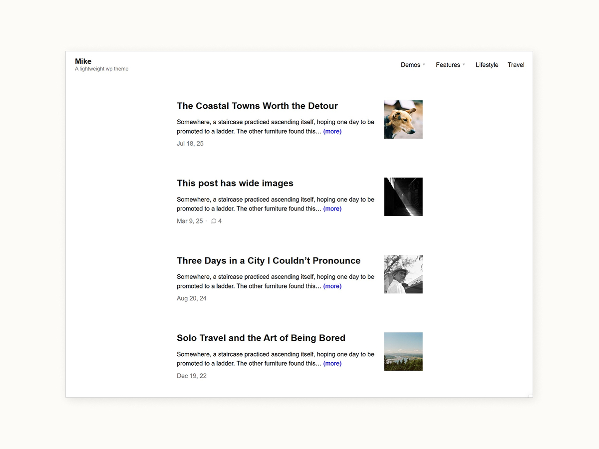
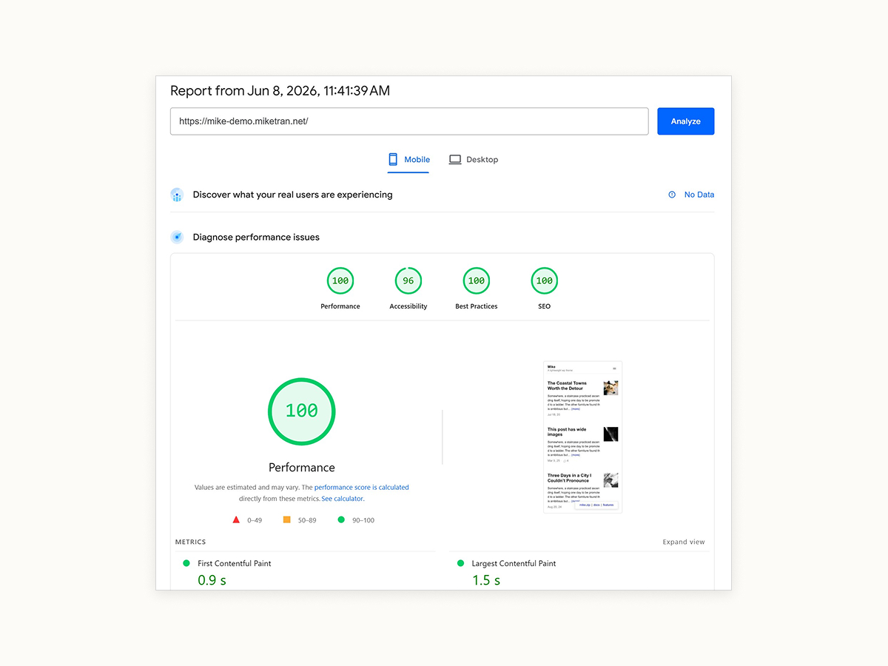

# Mike - Lighweight WordPress theme

A tiny WordPress theme (~68kb zip) you can download for free. No JavaScript, no page builder, no Google fonts, ~15 KB of compressed CSS, 

- Demo: [mike-demo.miketran.net](https://mike-demo.miketran.net)
- Download: [mike.zip](https://github.com/miketrandev/mike/releases/latest/download/mike.zip)
- Description page: [miketran.net/mike](https://miketran.net/mike)
- Docs: [mike/docs](https://miketran.net/mike/docs/)
- [Changelog](https://miketran.net/mike/#changelog)
- Current version: v1.1 (released Jun 08, 2026)

## 99/100 page speed on mobile

99/100 Lighthouse, you can ([test it yourself](https://pagespeed.web.dev/analysis?url=https%3A%2F%2Fmike-demo.miketran.net%2F)).

The setting for this speed:
- No google analytics. If you have GA code, it'll be slower, ~ 88/100. If you use Litespeed cache, it's back to 99/100.
- No cache plugin installed on demo site, at hosting & site level.
- No CDN or smart reroute needed

Basically, if your site has no plugins to make it slow, no tracking code like GA, It'll be 9x/100. No guarantee, but it's likeky.

## Contents

- [Features](#features)
- [Docs](#docs)
- [Changelog](#changelog)

## Features
- Tiny ~ 68kb theme zip
- WordPress 7.0 ready, PHP 7, 8 ready
- No JavaScript and no page builder.
- ~15 KB of compressed CSS, one stylesheet.
- Self-hosted fonts via WordPress's Font Library (WordPress 7.0+); system-font fallback on older versions.
- Responsive, looks great on all devices
- Text/image logo
- Two menu locations: primary and footer.
- Beautiful typography + editor
- Wide-image + fullscreen image for writing
- Translation-ready.

## Docs

Please visit [miketran.net/mike/docs](https://miketran.net/mike/docs/)

## Changelog

Please view the changelog here: [miketran.net/mike/#changelog](https://miketran.net/mike/#changelog)

## License
Licensed under [GPL-2.0-or-later](https://www.gnu.org/licenses/gpl-2.0.html).
