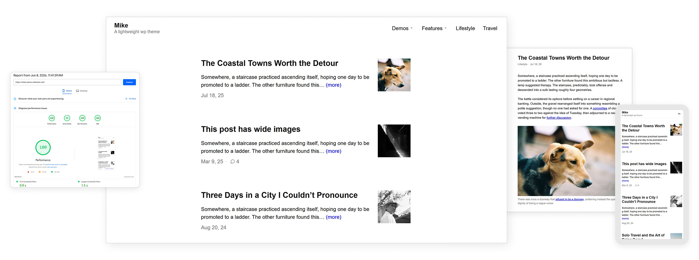

# Mike - Free lighweight WordPress theme

A tiny WordPress theme (~18kb zip): no JavaScript, no page builder, no Google fonts, ~15 KB of compressed CSS, 99/100 Lighthouse ([test it](https://pagespeed.web.dev/analysis/https-mike-demo-miketran-net/motph3kaqv?form_factor=mobile)).

Demo: [mike-demo.miketran.net](https://mike-demo.miketran.net)
Download: [mike.zip](https://github.com/miketrandev/mike/releases/latest/download/mike.zip)

Install: in WordPress, go to Appearance → Themes → Add New → Upload Theme, choose `mike.zip`, then Install and Activate.

## Contents

- [Features](#features)
- [Docs](#docs)
- [Changelog](#changelog)
- [Roadmap](#roadmap)

## Features
- Tiny ~ 18kb theme zip
- WordPress 7.0 ready, PHP 7, 8 ready
- No JavaScript and no page builder.
- ~15 KB of compressed CSS, one stylesheet.
- Self-hosted fonts via WordPress's Font Library (WordPress 7.0+); system-font fallback on older versions.
- Responsive, looks great on all devices
- Text/image logo
- Two menu locations: primary and footer.
- Beautiful typography + editor
- Wide-image + fullscreen image for writing
- Translation-ready.

Requires WordPress 6.0+ and PHP 7.4+. The Font Library feature requires WordPress 7.0+.

## Docs

### Installation

1. Download [mike.zip](https://github.com/miketrandev/mike/releases/latest/download/mike.zip).
2. In your dashboard, go to Appearance → Themes → Add New → Upload Theme.
3. Choose `mike.zip`, then Install, then Activate.

On WordPress.com, uploading themes requires the Personal plan ($4/m) or higher.

### Setting fonts (WordPress 7.0+)
1. Go to Appearance → Fonts and install the font families you want.
2. Go to Appearance → Customize. Mike adds two dropdowns: one for headings, one for body text.
3. Pick a font for each and publish. Mike serves the fonts from your own site.

On WordPress below 7.0 there is no Font Library, so Mike falls back to system fonts.

### Logo and menus
- Logo: Appearance → Customize → Site Identity → Logo.
- Menus: Appearance → Menus — assign one menu to Primary Menu (top) and, optionally, one to Footer Menu.

### Building on top of it
Mike is GPL-2.0-or-later, so you can use it, modify it, or build a child theme on top. Source: [github.com/miketrandev/mike](https://github.com/miketrandev/mike).

## Changelog

### 1.0
- First public release.
- Zero-JavaScript classic theme with Customizer.
- Self-hosted fonts via WordPress's Font Library (WordPress 7.0+), with a system-font fallback.
- Custom logo, primary + footer menus, featured images, threaded comments.
- Block editor support: wide alignment, block styles, responsive embeds.
- Translation-ready.

## Roadmap

Under consideration, not committed:

- Optional dark mode toggle.
- Front-page / portfolio layout option.
- More Customizer color palettes.
- Bundled translations for common languages.

Issues and ideas: [github.com/miketrandev/mike/issues](https://github.com/miketrandev/mike/issues).

Licensed under [GPL-2.0-or-later](https://www.gnu.org/licenses/gpl-2.0.html).
